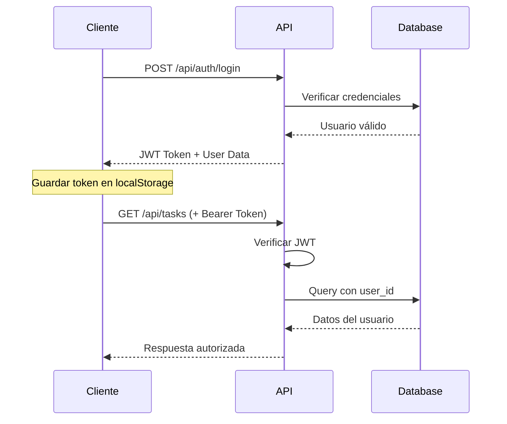

# TodoList Backend API

Backend API REST para aplicación TodoList construida con Node.js, Express, TypeScript, PostgreSQL y Redis.

## 🚀 Características Principales

- **API RESTful** con Express.js y TypeScript
- **Base de datos PostgreSQL** con pool de conexiones
- **Cache Redis** para optimización de rendimiento
- **Autenticación JWT** con refresh tokens
- **Validación robusta** con Zod/Joi schemas
- **Rate limiting** y middleware de seguridad avanzado
- **CORS configurado** para desarrollo y producción
- **Logging estructurado** con Winston
- **Health checks** y monitoring
- **Docker Compose** para desarrollo local
- **Migraciones automáticas** de base de datos
- **Documentación Swagger/OpenAPI**

## 🛠️ Stack Tecnológico

- **Runtime**: Node.js 20+
- **Lenguaje**: TypeScript
- **Framework**: Express.js
- **Base de Datos**: PostgreSQL 16
- **Cache**: Redis 7
- **Autenticación**: JWT (jsonwebtoken)
- **Validación**: Zod schemas
- **Logging**: Winston
- **Testing**: Jest + Supertest
- **Containerización**: Docker & Docker Compose

## 📋 Requisitos del Sistema

- **Node.js** 20.x o superior
- **npm** 10.x o superior
- **Docker** 24.x y Docker Compose 2.x
- **PostgreSQL** 16+ (se incluye en Docker)
- **Redis** 7+ (se incluye en Docker)

## ⚡ Inicio Rápido

### 1. Configuración inicial

```bash
# Clonar el repositorio
git clone <repository-url>
cd TodoList/backend

# Copiar variables de entorno
cp .env.example .env

# Instalar dependencias
npm install
```

### 2. Configurar variables de entorno

Edita el archivo `.env` con tus configuraciones:

```env
# Aplicación
NODE_ENV=development
PORT=3000

# Base de datos PostgreSQL
DB_HOST=localhost
DB_PORT=5432
DB_NAME=todolist_db
DB_USER=todolist_user
DB_PASSWORD=todolist_password

# Redis
REDIS_HOST=localhost
REDIS_PORT=6379
REDIS_PASSWORD=todolist_redis_password

# JWT
JWT_SECRET=your-super-secret-jwt-key-change-in-production
JWT_EXPIRES_IN=24h

# CORS (Frontend URL)
CORS_ORIGIN=http://localhost:5173
```

### 3. Iniciar servicios con Docker

```bash
# Iniciar solo PostgreSQL y Redis
docker-compose up -d postgres redis

# O iniciar todo el stack completo
docker-compose up -d
```

### 4. Ejecutar migraciones

```bash
# Ejecutar migraciones de base de datos
npm run db:migrate

# Opcional: poblar con datos de prueba
npm run db:seed
```

### 5. Iniciar servidor de desarrollo

```bash
# Servidor con hot reload y TypeScript
npm run dev

# El servidor estará disponible en:
# http://localhost:3000
# Documentación API: http://localhost:3000/api/docs
```

## 📚 Scripts Disponibles

```bash
# Desarrollo
npm run dev              # Servidor con hot reload
npm start               # Servidor producción

# Base de datos
npm run db:migrate      # Ejecutar migraciones
npm run db:seed         # Poblar con datos de prueba
npm run db:reset        # Reset completo (migrate + seed)

# Testing
npm test               # Ejecutar tests
npm run test:watch     # Tests en modo watch
npm run test:coverage  # Tests con coverage

# Código
npm run lint           # Linting con corrección
npm run format         # Formatear código

# Docker
npm run docker:up      # Levantar servicios
npm run docker:down    # Bajar servicios
npm run docker:logs    # Ver logs del backend
```

## 🔗 API Endpoints

### 🏥 Sistema

- `GET /health` - Health check del servidor y servicios
- `GET /api/docs` - Documentación Swagger de la API

### 🔐 Autenticación

- `POST /api/auth/register` - Registrar nuevo usuario

  ```json
  {
    "name": "Usuario Ejemplo",
    "email": "usuario@ejemplo.com",
    "password": "password123"
  }
  ```

- `POST /api/auth/login` - Iniciar sesión

  ```json
  {
    "email": "usuario@ejemplo.com",
    "password": "password123"
  }
  ```

- `GET /api/auth/perfil` - Obtener perfil del usuario autenticado
  - Requiere: `Authorization: Bearer <token>`

### ✅ Gestión de Tareas

- `GET /api/tasks` - Listar tareas con filtros y paginación
  - Query params: `page`, `limit`, `completed`, `priority`, `category_id`, `tag_id`, `search`
- `POST /api/tasks` - Crear nueva tarea

  ```json
  {
    "title": "Mi nueva tarea",
    "description": "Descripción opcional",
    "priority": "medium",
    "due_date": "2024-12-31",
    "category_id": 1,
    "tags": [1, 2, 3]
  }
  ```

- `GET /api/tasks/:id` - Obtener tarea específica
- `PUT /api/tasks/:id` - Actualizar tarea completa
- `PATCH /api/tasks/:id/toggle` - Cambiar estado completado/pendiente
- `DELETE /api/tasks/:id` - Eliminar tarea

### 🏷️ Categorías

- `GET /api/categories` - Listar todas las categorías del usuario
- `POST /api/categories` - Crear nueva categoría

  ```json
  {
    "name": "Trabajo",
    "description": "Tareas relacionadas con el trabajo",
    "color": "#3498db"
  }
  ```

- `PUT /api/categories/:id` - Actualizar categoría
- `DELETE /api/categories/:id` - Eliminar categoría

### 🏷️ Etiquetas

- `GET /api/tags` - Listar todas las etiquetas del usuario
- `POST /api/tags` - Crear nueva etiqueta

  ```json
  {
    "name": "urgente",
    "color": "#e74c3c"
  }
  ```

- `PUT /api/tags/:id` - Actualizar etiqueta
- `DELETE /api/tags/:id` - Eliminar etiqueta

## 🗄️ Esquema de Base de Datos

### Tablas Principales

```sql
-- Usuarios del sistema
usuarios (
  id SERIAL PRIMARY KEY,
  name VARCHAR(100) NOT NULL,
  email VARCHAR(255) UNIQUE NOT NULL,
  password_hash VARCHAR(255) NOT NULL,
  created_at TIMESTAMP DEFAULT NOW()
);

-- Categorías de tareas
categorias (
  id SERIAL PRIMARY KEY,
  name VARCHAR(100) NOT NULL,
  description TEXT,
  color VARCHAR(7), -- Hex color
  user_id INTEGER REFERENCES usuarios(id),
  created_at TIMESTAMP DEFAULT NOW()
);

-- Tareas principales
tareas (
  id SERIAL PRIMARY KEY,
  title VARCHAR(255) NOT NULL,
  description TEXT,
  completed BOOLEAN DEFAULT FALSE,
  priority VARCHAR(20) CHECK (priority IN ('low', 'medium', 'high')),
  due_date DATE,
  category_id INTEGER REFERENCES categorias(id),
  user_id INTEGER REFERENCES usuarios(id) NOT NULL,
  created_at TIMESTAMP DEFAULT NOW(),
  updated_at TIMESTAMP DEFAULT NOW()
);

-- Etiquetas/Tags
etiquetas (
  id SERIAL PRIMARY KEY,
  name VARCHAR(50) NOT NULL,
  color VARCHAR(7),
  user_id INTEGER REFERENCES usuarios(id) NOT NULL,
  created_at TIMESTAMP DEFAULT NOW()
);

-- Relación muchos-a-muchos: tareas ↔ etiquetas
tarea_etiquetas (
  tarea_id INTEGER REFERENCES tareas(id) ON DELETE CASCADE,
  etiqueta_id INTEGER REFERENCES etiquetas(id) ON DELETE CASCADE,
  PRIMARY KEY (tarea_id, etiqueta_id)
);
```

### Índices de Performance

```sql
-- Índices para queries frecuentes
CREATE INDEX idx_tareas_user_id ON tareas(user_id);
CREATE INDEX idx_tareas_completed ON tareas(completed);
CREATE INDEX idx_tareas_priority ON tareas(priority);
CREATE INDEX idx_tareas_due_date ON tareas(due_date);
CREATE INDEX idx_categorias_user_id ON categorias(user_id);
CREATE INDEX idx_etiquetas_user_id ON etiquetas(user_id);
```

## 🔧 Configuración Avanzada

### Variables de Entorno Completas

```env
# === APLICACIÓN ===
NODE_ENV=development
PORT=3000
API_VERSION=v1

# === BASE DE DATOS POSTGRESQL ===
DB_HOST=localhost
DB_PORT=5432
DB_NAME=todolist_db
DB_USER=todolist_user
DB_PASSWORD=todolist_password
DB_MAX_CONNECTIONS=20
DB_IDLE_TIMEOUT=30000
DB_CONNECTION_TIMEOUT=2000

# === REDIS CACHE ===
REDIS_HOST=localhost
REDIS_PORT=6379
REDIS_PASSWORD=todolist_redis_password
REDIS_DB=0
REDIS_TTL_DEFAULT=300

# === AUTENTICACIÓN JWT ===
JWT_SECRET=your-super-secret-jwt-key-change-in-production-minimum-32-characters
JWT_EXPIRES_IN=24h
JWT_ISSUER=todolist-app
JWT_ALGORITHM=HS256

# === CORS ===
CORS_ORIGIN=http://localhost:5173
CORS_METHODS=GET,HEAD,PUT,PATCH,POST,DELETE
CORS_ALLOWED_HEADERS=Content-Type,Authorization
CORS_CREDENTIALS=true

# === RATE LIMITING ===
RATE_LIMIT_WINDOW_MS=900000
RATE_LIMIT_MAX_REQUESTS=100

# === LOGGING ===
LOG_LEVEL=info
LOG_FORMAT=combined
LOG_FILE_ERROR=logs/error.log
LOG_FILE_COMBINED=logs/combined.log

# === FEATURE FLAGS ===
FEATURE_EMAIL_NOTIFICATIONS=false
FEATURE_FILE_UPLOAD=true
FEATURE_BULK_OPERATIONS=true
```

### Docker Compose Services

Los servicios incluidos en el stack:

- **postgres**: PostgreSQL 16 con configuración optimizada
- **redis**: Redis 7 para cache y sesiones
- **backend**: API Node.js con TypeScript
- **pgadmin**: Administrador web de PostgreSQL (opcional)

### Health Checks

El endpoint `/health` verifica:

- ✅ Estado del servidor Node.js
- ✅ Conectividad PostgreSQL
- ✅ Conectividad Redis
- ✅ Uso de memoria y CPU
- ✅ Tiempo de respuesta

## 🧪 Testing y Calidad

### Ejecutar Tests

```bash
# Test suite completo
npm test

# Tests específicos
npm test -- --grep "auth"
npm test -- --grep "tasks"

# Coverage detallado
npm run test:coverage

# Tests en modo watch
npm run test:watch
```

### Estructura de Tests

```
tests/
├── unit/               # Tests unitarios
│   ├── auth.test.js
│   ├── tasks.test.js
│   └── categories.test.js
├── integration/        # Tests de integración
│   ├── api.test.js
│   └── database.test.js
└── fixtures/          # Datos de prueba
    └── sample-data.js
```

### Linting y Formateo

```bash
# ESLint con corrección automática
npm run lint

# Solo verificar sin corregir
npm run lint:check

# Formatear con Prettier
npm run format

# Verificar tipos TypeScript
npm run type-check
```

## 📝 Logging y Monitoring

### Sistema de Logs

Los logs se estructuran con Winston:

```typescript
// Levels de logging
{
  error: 0,    // Errores críticos
  warn: 1,     // Advertencias
  info: 2,     // Información general
  http: 3,     // Requests HTTP
  debug: 4     // Debug detallado
}
```

### Archivos de Log

- `logs/error.log` - Solo errores y advertencias
- `logs/combined.log` - Todos los niveles de log
- `logs/access.log` - Logs de acceso HTTP
- Consola - Logs formateados para desarrollo

### Métricas y Health

```bash
# Health check completo
curl http://localhost:3000/health

# Respuesta ejemplo:
{
  "status": "healthy",
  "timestamp": "2024-08-14T21:30:00.000Z",
  "uptime": "2h 15m 30s",
  "services": {
    "database": "connected",
    "redis": "connected"
  },
  "memory": {
    "used": "45.2 MB",
    "free": "2.1 GB"
  }
}
```

## 🔒 Seguridad y Autenticación

### Medidas de Seguridad Implementadas

- **🔐 Autenticación JWT**: Tokens con expiración configurable
- **🛡️ Rate Limiting**: Protección contra ataques de fuerza bruta
- **🔒 Hash de Contraseñas**: bcrypt con 12 rounds por defecto
- **🚫 SQL Injection**: Consultas parametrizadas y prepared statements
- **🛡️ Headers de Seguridad**: Helmet.js con configuración robusta
- **✅ Validación de Entrada**: Schemas Zod/Joi para todos los endpoints
- **🔍 CORS Configurado**: Origen específico para producción
- **📝 Logging de Seguridad**: Registro de intentos de acceso

### Flujo de Autenticación



### Configuración JWT

```typescript
// Configuración por defecto
{
  algorithm: 'HS256',
  expiresIn: '24h',
  issuer: 'todolist-app',
  audience: 'todolist-users'
}
```

## 📦 Arquitectura del Proyecto

```
backend/
├── 📁 src/                    # Código fuente TypeScript
│   ├── 📁 config/            # Configuraciones
│   │   ├── database.ts       # Config PostgreSQL
│   │   ├── env.ts           # Variables de entorno
│   │   └── swagger.ts       # Documentación API
│   ├── 📁 controllers/       # Controladores de rutas
│   │   ├── authController.ts
│   │   ├── taskController.ts
│   │   ├── categoryController.ts
│   │   └── tagController.ts
│   ├── 📁 middleware/        # Middleware personalizado
│   │   ├── auth.ts          # Verificación JWT
│   │   ├── validation.ts    # Validación Zod
│   │   ├── rateLimiting.ts  # Rate limiting
│   │   └── errorHandler.ts  # Manejo de errores
│   ├── 📁 routes/           # Definición de rutas
│   │   ├── auth.ts
│   │   ├── tasks.ts
│   │   ├── categories.ts
│   │   └── tags.ts
│   ├── 📁 services/         # Lógica de negocio
│   │   ├── authService.ts
│   │   ├── taskService.ts
│   │   ├── categoryService.ts
│   │   └── cacheService.ts
│   ├── 📁 types/            # Definiciones TypeScript
│   │   ├── auth.ts
│   │   ├── task.ts
│   │   └── api.ts
│   ├── 📁 scripts/          # Scripts de utilidad
│   │   ├── migrate.ts
│   │   └── seed.ts
│   ├── app.ts              # Configuración Express
│   └── server.ts           # Punto de entrada
├── 📁 migrations/           # Migraciones SQL
│   ├── 001_create_usuarios.sql
│   ├── 002_create_categorias.sql
│   ├── 003_create_tareas.sql
│   ├── 004_create_etiquetas.sql
│   └── 005_create_tarea_etiquetas.sql
├── 📁 tests/               # Suite de testing
├── 📁 logs/                # Archivos de log
├── 📁 uploads/             # Archivos subidos
├── 📁 dist/                # JavaScript compilado
├── 🐳 docker-compose.yml   # Servicios Docker
├── 🐳 Dockerfile          # Imagen backend
├── 📋 package.json        # Dependencias npm
├── ⚙️ tsconfig.json       # Config TypeScript
└── 📖 README.md           # Este archivo
```

### Patrones de Arquitectura

- **🏗️ Arquitectura en Capas**: Controllers → Services → Database
- **🔧 Dependency Injection**: Servicios inyectados en controllers
- **📝 Repository Pattern**: Abstracción de acceso a datos
- **🔒 Middleware Chain**: Autenticación, validación, rate limiting
- **🎯 Single Responsibility**: Cada módulo tiene una responsabilidad específica

## 🚀 Despliegue y Producción

### 🏭 Preparación para Producción

```bash
# 1. Compilar TypeScript
npm run build

# 2. Configurar variables de entorno de producción
cp .env.example .env.production
# Editar .env.production con valores de producción

# 3. Ejecutar migraciones
NODE_ENV=production npm run db:migrate

# 4. Iniciar en modo producción
NODE_ENV=production npm start
```

### 🐳 Despliegue con Docker

```bash
# Construcción para producción
docker build -t todolist-backend:latest .

# Stack completo de producción
docker-compose -f docker-compose.prod.yml up -d

# Verificar servicios
docker-compose ps
docker-compose logs -f backend
```

### ☁️ Configuración para Cloud

#### Variables de Entorno de Producción

```env
NODE_ENV=production
PORT=3000

# Base de datos (ej: AWS RDS, Google Cloud SQL)
DB_HOST=your-production-db-host
DB_NAME=todolist_prod
DB_USER=prod_user
DB_PASSWORD=secure_production_password

# Redis (ej: AWS ElastiCache, Redis Cloud)
REDIS_HOST=your-production-redis-host
REDIS_PASSWORD=secure_redis_password

# JWT con clave segura
JWT_SECRET=your-ultra-secure-production-jwt-secret-minimum-64-characters

# CORS para dominio de producción
CORS_ORIGIN=https://your-frontend-domain.com
```

#### Checklist de Producción

- [ ] SSL/TLS configurado (HTTPS)
- [ ] Reverse proxy (nginx/Apache) configurado
- [ ] Rate limiting ajustado para producción
- [ ] Logs centralizados (ELK Stack, CloudWatch)
- [ ] Monitoring y alertas configurados
- [ ] Backups de base de datos automatizados
- [ ] Variables de entorno seguras
- [ ] Health checks implementados
- [ ] Process manager (PM2, systemd) configurado

## 🐛 Troubleshooting y Solución de Problemas

### ❌ Errores Comunes y Soluciones

#### 🚫 "Puerto en uso"

```bash
# Error: EADDRINUSE :::3000
# Solución 1: Cambiar puerto
echo "PORT=3001" >> .env

# Solución 2: Matar proceso en puerto 3000
npx kill-port 3000
# o en Windows:
netstat -ano | findstr :3000
taskkill /PID <PID> /F
```

#### 🗄️ "Database connection failed"

```bash
# Verificar servicios Docker
docker-compose ps

# Revisar logs de PostgreSQL
docker-compose logs postgres

# Reiniciar servicios de DB
docker-compose restart postgres redis

# Verificar conectividad
npm run db:status
```

#### 🔴 "Redis connection error"

```bash
# Verificar configuración Redis
docker-compose logs redis

# Test manual de conexión
redis-cli -h localhost -p 6379 ping

# Reiniciar Redis
docker-compose restart redis
```

#### 📦 "Migration errors"

```bash
# Ver estado actual de migraciones
npm run db:status

# Reset completo de DB (CUIDADO: borra todos los datos)
npm run db:reset

# Ejecutar migraciones manualmente
npm run db:migrate

# Verificar permisos de usuario de DB
psql -h localhost -U todolist_user -d todolist_db
```

### 📊 Logs Útiles para Debug

```bash
# Ver logs en tiempo real
docker-compose logs -f backend

# Logs específicos con filtro
docker-compose logs backend | grep ERROR

# Logs de base de datos
docker-compose logs postgres | tail -50

# Logs del sistema completo
docker-compose logs --tail=100
```

### 🔍 Comandos de Diagnóstico

```bash
# Health check manual
curl -X GET http://localhost:3000/health

# Verificar endpoints principales
curl -X GET http://localhost:3000/api/docs

# Test de autenticación
curl -X POST http://localhost:3000/api/auth/login \
  -H "Content-Type: application/json" \
  -d '{"email":"test@example.com","password":"password123"}'

# Verificar headers CORS
curl -H "Origin: http://localhost:5173" \
  -H "Access-Control-Request-Method: POST" \
  -H "Access-Control-Request-Headers: X-Requested-With" \
  -X OPTIONS http://localhost:3000/api/auth/login
```

### 🚨 Problemas Conocidos

| Problema          | Causa                                  | Solución                              |
| ----------------- | -------------------------------------- | ------------------------------------- |
| CORS error        | Frontend/backend en puertos diferentes | Actualizar `CORS_ORIGIN` en `.env`    |
| JWT expired       | Token caducado                         | Reloguear usuario                     |
| 401 en login      | Credenciales incorrectas               | Verificar email/password              |
| Port 5432 in use  | PostgreSQL ya ejecutándose             | `sudo service postgresql stop`        |
| Docker permission | Permisos Docker                        | `sudo chmod 666 /var/run/docker.sock` |

## 🤝 Contribución y Desarrollo

### 🔄 Flujo de Contribución

1. **Fork** del repositorio principal
2. **Crear rama** de feature: `git checkout -b feature/nueva-funcionalidad`
3. **Implementar** cambios con tests correspondientes
4. **Ejecutar** suite de testing: `npm test`
5. **Verificar** linting: `npm run lint`
6. **Commit** con mensaje descriptivo: `git commit -m 'feat: agregar endpoint de búsqueda avanzada'`
7. **Push** a tu fork: `git push origin feature/nueva-funcionalidad`
8. **Crear** Pull Request con descripción detallada

### 📝 Convenciones de Código

#### Commits (Conventional Commits)

```bash
feat: nueva funcionalidad
fix: corrección de bug
docs: actualización de documentación
style: cambios de formato (no afectan la lógica)
refactor: refactorización de código
test: agregar/modificar tests
chore: tareas de mantenimiento
```

#### Estructura de Archivos

- **camelCase** para variables y funciones
- **PascalCase** para clases y tipos TypeScript
- **kebab-case** para nombres de archivos
- **UPPER_CASE** para constantes y variables de entorno

#### TypeScript

```typescript
// Usar tipos explícitos
interface UserCreateRequest {
  name: string;
  email: string;
  password: string;
}

// Async/await preferido sobre Promises
async function createUser(data: UserCreateRequest): Promise<User> {
  // implementación
}
```

### 🧪 Guías de Testing

```typescript
// Test unitario ejemplo
describe('TaskService', () => {
  it('should create task with valid data', async () => {
    const taskData = {
      title: 'Test Task',
      priority: 'medium' as const,
    };

    const result = await taskService.create(taskData);

    expect(result).toHaveProperty('id');
    expect(result.title).toBe(taskData.title);
  });
});
```

### 📋 Checklist pre-Pull Request

- [ ] ✅ Tests pasan: `npm test`
- [ ] 🔍 Linting limpio: `npm run lint`
- [ ] 📝 Documentación actualizada
- [ ] 🏷️ Tipos TypeScript correctos
- [ ] 🔒 No credenciales en el código
- [ ] 📊 Logs apropiados añadidos
- [ ] 🚀 Funciona en entorno Docker
- [ ] 📱 Endpoint probado con Postman/curl

## 📄 Licencia

Este proyecto está bajo la **MIT License**.

```
MIT License

Copyright (c) 2024 TodoList Project

Permission is hereby granted, free of charge, to any person obtaining a copy
of this software and associated documentation files (the "Software"), to deal
in the Software without restriction, including without limitation the rights
to use, copy, modify, merge, publish, distribute, sublicense, and/or sell
copies of the Software, and to permit persons to whom the Software is
furnished to do so, subject to the following conditions:

The above copyright notice and this permission notice shall be included in all
copies or substantial portions of the Software.

THE SOFTWARE IS PROVIDED "AS IS", WITHOUT WARRANTY OF ANY KIND, EXPRESS OR
IMPLIED, INCLUDING BUT NOT LIMITED TO THE WARRANTIES OF MERCHANTABILITY,
FITNESS FOR A PARTICULAR PURPOSE AND NONINFRINGEMENT.
```

---

## 📞 Soporte y Contacto

- **📧 Issues**: [GitHub Issues](https://github.com/owner/TodoList/issues)
- **📖 Wiki**: [Documentación completa](https://github.com/owner/TodoList/wiki)
- **💬 Discussions**: [GitHub Discussions](https://github.com/owner/TodoList/discussions)

---

<div align="center">

**🌟 ¡Dale una estrella si este proyecto te resulta útil! 🌟**

[](https://github.com/owner/TodoList)
[](https://github.com/owner/TodoList)

Hecho con ❤️ por el equipo de TodoList

</div>
