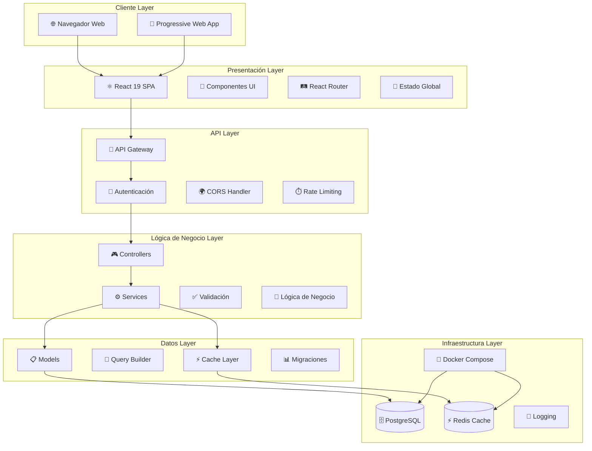
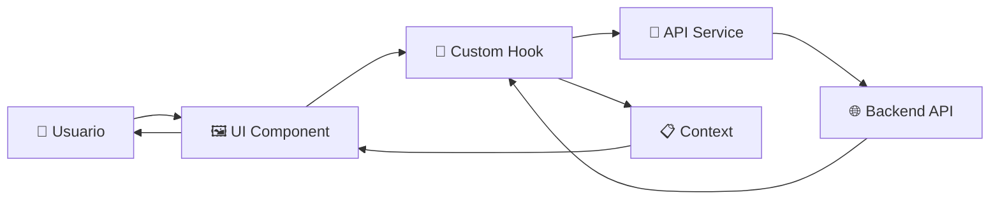
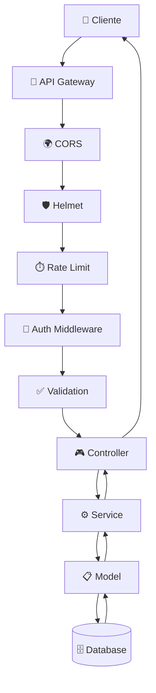
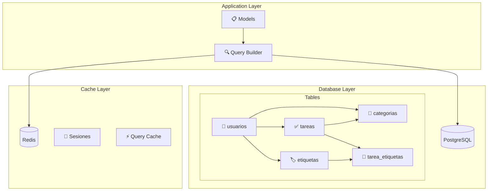
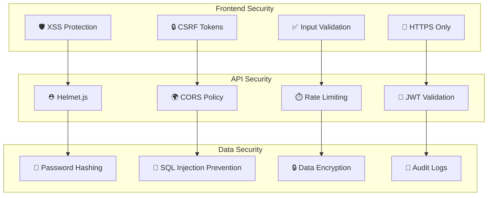

# Arquitectura del Sistema - Todo List Application

## 🏗️ **Visión General de la Arquitectura**

La aplicación Todo List está diseñada siguiendo una arquitectura moderna de 3 capas con separación clara de responsabilidades, utilizando las mejores prácticas de desarrollo full-stack.



## 🎯 **Principios Arquitectónicos**

### 1. **Separación de Responsabilidades**

- **Frontend**: Únicamente presentación y UX
- **Backend**: Lógica de negocio y acceso a datos
- **Database**: Persistencia y integridad de datos

### 2. **Arquitectura por Capas**

- **Presentación**: React components + state management
- **API**: Express routes + middleware
- **Negocio**: Services + business logic
- **Datos**: Models + database access

### 3. **Principios SOLID**

- **S**: Cada clase/módulo tiene una responsabilidad única
- **O**: Abierto para extensión, cerrado para modificación
- **L**: Substituibilidad de componentes
- **I**: Interfaces segregadas y específicas
- **D**: Dependencias invertidas e inyectadas

### 4. **DRY (Don't Repeat Yourself)**

- Componentes reutilizables
- Hooks personalizados
- Servicios compartidos
- Utilities comunes

## 🏛️ **Patrones de Diseño Implementados**

### **Frontend Patterns**

#### 1. **Component Composition Pattern**

```javascript
// Composición de componentes reutilizables
<Layout>
  <Header />
  <Sidebar>
    <Navigation />
    <QuickActions />
  </Sidebar>
  <MainContent>
    <TaskList>
      <TaskFilter />
      <TaskItem />
    </TaskList>
  </MainContent>
</Layout>
```

#### 2. **Custom Hooks Pattern**

```javascript
// Lógica reutilizable encapsulada
const useTareas = () => {
  const [tareas, setTareas] = useState([])
  const [loading, setLoading] = useState(false)
  const [error, setError] = useState(null)

  const crearTarea = useCallback(async (tarea) => {
    // Lógica de creación
  }, [])

  return { tareas, loading, error, crearTarea }
}
```

#### 3. **Context + Reducer Pattern**

```javascript
// Estado global predecible
const AuthContext = createContext()
const authReducer = (state, action) => {
  switch (action.type) {
    case 'LOGIN':
      return { ...state, user: action.user, isAuthenticated: true }
    case 'LOGOUT':
      return { ...state, user: null, isAuthenticated: false }
    default:
      return state
  }
}
```

### **Backend Patterns**

#### 1. **MVC Pattern (Modificado)**

```javascript
// Controller
const crearTarea = async (req, res, next) => {
  try {
    const tarea = await tareasService.crear(req.body, req.user.id)
    res.status(201).json({ success: true, data: tarea })
  } catch (error) {
    next(error)
  }
}

// Service
const crear = async (dataTarea, usuarioId) => {
  const tareaValidada = await validarTarea(dataTarea)
  return await Tarea.crear({ ...tareaValidada, usuarioId })
}

// Model
const crear = async (dataTarea) => {
  const query = 'INSERT INTO tareas (...) VALUES (...) RETURNING *'
  const result = await db.query(query, [values])
  return result.rows[0]
}
```

#### 2. **Repository Pattern**

```javascript
class TareaRepository {
  async encontrarPorUsuario(usuarioId, filtros = {}) {
    let query = 'SELECT * FROM tareas WHERE usuario_id = $1'
    const params = [usuarioId]

    if (filtros.completada !== undefined) {
      query += ' AND completada = $2'
      params.push(filtros.completada)
    }

    return await db.query(query, params)
  }
}
```

#### 3. **Middleware Chain Pattern**

```javascript
// Pipeline de middlewares
app.use('/api/tareas', [
  helmet(),
  cors(),
  rateLimiter,
  authMiddleware,
  validationMiddleware,
  tareasRouter,
])
```

## 📱 **Arquitectura Frontend Detallada**

### **Estructura de Carpetas**

```
src/
├── components/           # Componentes UI reutilizables
│   ├── auth/            # Componentes de autenticación
│   ├── tasks/           # Componentes de tareas
│   ├── common/          # Componentes comunes
│   └── layout/          # Componentes de layout
├── hooks/               # Custom hooks
├── context/             # Context providers
├── services/            # API services
├── utils/               # Utilidades
├── styles/              # Estilos globales
└── types/               # TypeScript types (si aplica)
```

### **Flujo de Datos**



### **Estado de la Aplicación**

1. **Local State**: useState para estado de componente
2. **Global State**: Context API para auth y configuración
3. **Server State**: Custom hooks para datos del servidor
4. **URL State**: React Router para navegación

## 🚀 **Arquitectura Backend Detallada**

### **Estructura de Carpetas**

```
src/
├── config/              # Configuración
├── controllers/         # Controladores
├── services/           # Lógica de negocio
├── models/             # Modelos de datos
├── middleware/         # Middlewares
├── routes/             # Definición de rutas
├── utils/              # Utilidades
└── validators/         # Validadores
```

### **Flujo de Request/Response**



### **Manejo de Errores**

```javascript
// Error Handler centralizado
const errorHandler = (error, req, res, next) => {
  const { statusCode = 500, message, stack } = error

  logger.error({
    error: message,
    stack: process.env.NODE_ENV === 'development' ? stack : undefined,
    url: req.url,
    method: req.method,
    ip: req.ip,
  })

  res.status(statusCode).json({
    success: false,
    error: message,
    ...(process.env.NODE_ENV === 'development' && { stack }),
  })
}
```

## 🗄️ **Arquitectura de Datos**

### **Capa de Persistencia**



### **Estrategias de Cache**

1. **Query Cache**: Resultados de búsquedas frecuentes (Redis)
2. **Session Cache**: Datos de sesión de usuario (Redis)
3. **Application Cache**: Configuraciones globales (Memoria)

### **Optimizaciones de Base de Datos**

```sql
-- Índices para performance
CREATE INDEX CONCURRENTLY idx_tareas_usuario_completada
ON tareas(usuario_id, completada);

CREATE INDEX CONCURRENTLY idx_tareas_busqueda
ON tareas USING gin(to_tsvector('spanish', titulo || ' ' || descripcion));

-- Particionado por fecha (futuro)
CREATE TABLE tareas_2025 PARTITION OF tareas
FOR VALUES FROM ('2025-01-01') TO ('2026-01-01');
```

## 🔒 **Arquitectura de Seguridad**

### **Capas de Seguridad**



### **Autenticación y Autorización**

```javascript
// JWT Strategy
const generateToken = (user) => {
  return jwt.sign({ id: user.id, email: user.email }, process.env.JWT_SECRET, {
    expiresIn: '24h',
    issuer: 'todolist-app',
  })
}

// Authorization middleware
const authorize = (req, res, next) => {
  const token = req.headers.authorization?.split(' ')[1]

  if (!token) {
    return res.status(401).json({ error: 'Token requerido' })
  }

  try {
    const decoded = jwt.verify(token, process.env.JWT_SECRET)
    req.user = decoded
    next()
  } catch (error) {
    return res.status(401).json({ error: 'Token inválido' })
  }
}
```

## 🚀 **Consideraciones de Escalabilidad**

### **Escalado Horizontal**

- **Stateless Backend**: Servicios sin estado
- **Database Pooling**: Conexiones eficientes
- **Load Balancing**: Distribución de carga
- **Microservices Ready**: Separación por dominio

### **Escalado Vertical**

- **Query Optimization**: Índices y consultas eficientes
- **Memory Management**: Gestión óptima de memoria
- **CPU Utilization**: Procesamiento asíncrono
- **Disk I/O**: SSD y compression

### **Optimizaciones de Performance**

```javascript
// Frontend optimizations
const TaskList = React.memo(({ tasks }) => {
  const virtualizedTasks = useVirtualization(tasks, { itemHeight: 60 })
  return <VirtualList items={virtualizedTasks} />
})

// Backend optimizations
const getTareas = async (usuarioId, filters) => {
  const cacheKey = `tareas:${usuarioId}:${JSON.stringify(filters)}`

  let result = await cache.get(cacheKey)
  if (!result) {
    result = await Tarea.findByUser(usuarioId, filters)
    await cache.set(cacheKey, result, { ttl: 300 }) // 5 min cache
  }

  return result
}
```

## 📊 **Monitoreo y Observabilidad**

### **Métricas de Aplicación**

- **Performance**: Tiempo de respuesta, throughput
- **Errores**: Rate de errores, tipos de errores
- **Usuarios**: Sesiones activas, engagement
- **Negocio**: Tareas creadas, completadas, etc.

### **Logging Strategy**

```javascript
const logger = winston.createLogger({
  level: 'info',
  format: winston.format.combine(
    winston.format.timestamp(),
    winston.format.errors({ stack: true }),
    winston.format.json()
  ),
  transports: [
    new winston.transports.File({ filename: 'logs/error.log', level: 'error' }),
    new winston.transports.File({ filename: 'logs/combined.log' }),
  ],
})
```

## 🔄 **Patrones de Integración**

### **API Design Patterns**

- **RESTful API**: Recursos y operaciones estándar
- **Consistent Response Format**: Formato uniforme de respuestas
- **Pagination**: Para listas grandes de datos
- **Filtering & Sorting**: Parámetros flexibles de consulta

### **Error Handling Patterns**

- **Graceful Degradation**: Funcionalidad básica sin fallos
- **Circuit Breaker**: Prevención de cascada de errores
- **Retry Logic**: Reintentos inteligentes
- **Fallback Strategies**: Alternativas cuando falla el servicio principal

Esta arquitectura proporciona una base sólida, escalable y mantenible para la aplicación Todo List, siguiendo las mejores prácticas de la industria y preparada para futuras expansiones.
