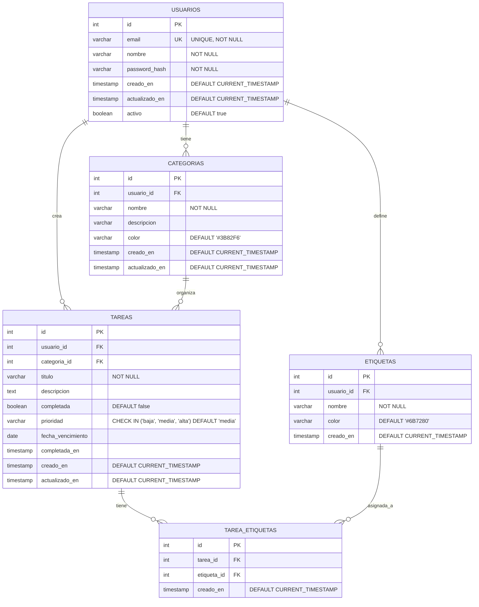

# Diagrama de Entidad-Relación (ERD)

## Estructura de Base de Datos - Todo List Application



## Descripción de Entidades

### 👤 **USUARIOS**

- **Propósito**: Gestión de usuarios del sistema
- **Campos clave**:
  - `email`: Identificador único para login
  - `password_hash`: Contraseña encriptada con bcrypt
  - `activo`: Para soft delete de usuarios

### 📁 **CATEGORIAS**

- **Propósito**: Organización de tareas por categorías personalizadas
- **Relación**: Un usuario puede tener múltiples categorías
- **Campos clave**:
  - `color`: Para identificación visual en la UI
  - `usuario_id`: Cada categoría pertenece a un usuario específico

### ✅ **TAREAS**

- **Propósito**: Entidad principal del sistema
- **Relaciones**:
  - Pertenece a un usuario
  - Puede tener una categoría (opcional)
  - Puede tener múltiples etiquetas
- **Campos clave**:
  - `prioridad`: Enum con valores predefinidos
  - `completada_en`: Timestamp cuando se marca como completada
  - `fecha_vencimiento`: Para funcionalidad de recordatorios

### 🏷️ **ETIQUETAS**

- **Propósito**: Sistema de etiquetado flexible para tareas
- **Relación**: Muchos a muchos con tareas
- **Uso**: Permite categorización cruzada y filtrado avanzado

### 🔗 **TAREA_ETIQUETAS**

- **Propósito**: Tabla de unión para relación muchos a muchos
- **Funcionalidad**: Permite que una tarea tenga múltiples etiquetas

## Índices Recomendados

```sql
-- Índices para optimización de consultas
CREATE INDEX idx_usuarios_email ON usuarios(email);
CREATE INDEX idx_tareas_usuario_id ON tareas(usuario_id);
CREATE INDEX idx_tareas_categoria_id ON tareas(categoria_id);
CREATE INDEX idx_tareas_completada ON tareas(completada);
CREATE INDEX idx_tareas_fecha_vencimiento ON tareas(fecha_vencimiento);
CREATE INDEX idx_tareas_prioridad ON tareas(prioridad);
CREATE INDEX idx_categorias_usuario_id ON categorias(usuario_id);
CREATE INDEX idx_etiquetas_usuario_id ON etiquetas(usuario_id);
CREATE INDEX idx_tarea_etiquetas_tarea_id ON tarea_etiquetas(tarea_id);
CREATE INDEX idx_tarea_etiquetas_etiqueta_id ON tarea_etiquetas(etiqueta_id);

-- Índice compuesto para búsquedas complejas
CREATE INDEX idx_tareas_usuario_completada_fecha ON tareas(usuario_id, completada, fecha_vencimiento);
```

## Constraints de Integridad

```sql
-- Foreign Keys
ALTER TABLE categorias ADD CONSTRAINT fk_categorias_usuario
    FOREIGN KEY (usuario_id) REFERENCES usuarios(id) ON DELETE CASCADE;

ALTER TABLE tareas ADD CONSTRAINT fk_tareas_usuario
    FOREIGN KEY (usuario_id) REFERENCES usuarios(id) ON DELETE CASCADE;

ALTER TABLE tareas ADD CONSTRAINT fk_tareas_categoria
    FOREIGN KEY (categoria_id) REFERENCES categorias(id) ON DELETE SET NULL;

ALTER TABLE etiquetas ADD CONSTRAINT fk_etiquetas_usuario
    FOREIGN KEY (usuario_id) REFERENCES usuarios(id) ON DELETE CASCADE;

ALTER TABLE tarea_etiquetas ADD CONSTRAINT fk_tarea_etiquetas_tarea
    FOREIGN KEY (tarea_id) REFERENCES tareas(id) ON DELETE CASCADE;

ALTER TABLE tarea_etiquetas ADD CONSTRAINT fk_tarea_etiquetas_etiqueta
    FOREIGN KEY (etiqueta_id) REFERENCES etiquetas(id) ON DELETE CASCADE;

-- Constraints únicos
ALTER TABLE categorias ADD CONSTRAINT uk_categorias_usuario_nombre
    UNIQUE (usuario_id, nombre);

ALTER TABLE etiquetas ADD CONSTRAINT uk_etiquetas_usuario_nombre
    UNIQUE (usuario_id, nombre);

ALTER TABLE tarea_etiquetas ADD CONSTRAINT uk_tarea_etiquetas
    UNIQUE (tarea_id, etiqueta_id);
```

## Consideraciones de Diseño

### 🔒 **Seguridad**

- Todas las entidades están aisladas por usuario (multitenancy por filas)
- Cascade deletes configurados apropiadamente
- Constraints únicos previenen duplicados

### 📈 **Escalabilidad**

- Índices optimizados para consultas frecuentes
- Soft delete para usuarios preserva integridad histórica
- Timestamps para auditoría y sincronización

### 🎯 **Funcionalidad**

- Soporte para filtrado avanzado por múltiples criterios
- Flexibilidad en organización (categorías + etiquetas)
- Tracking completo de estado y fechas
