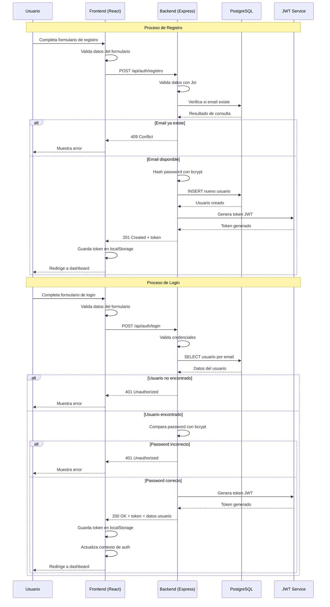
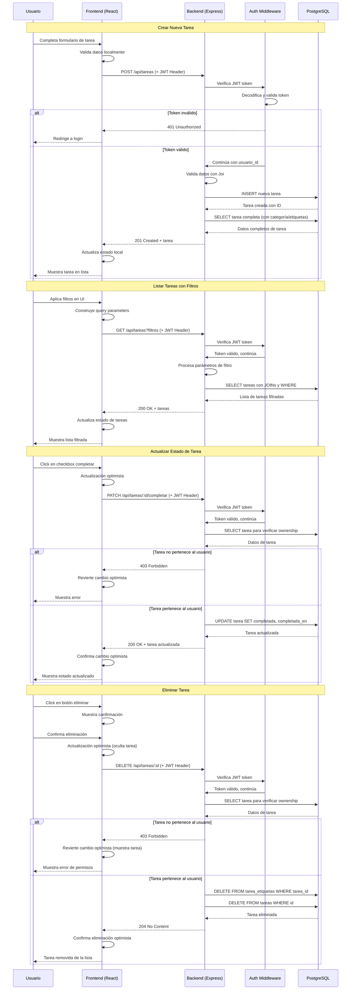
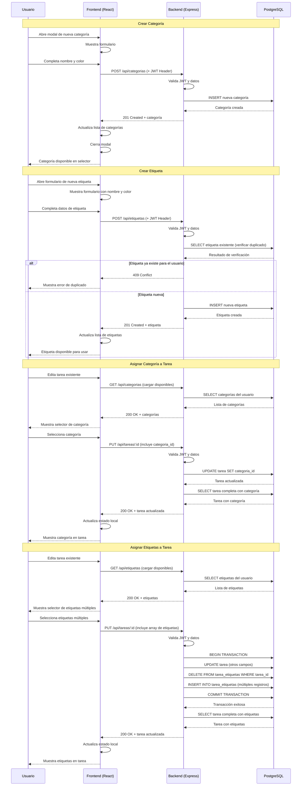
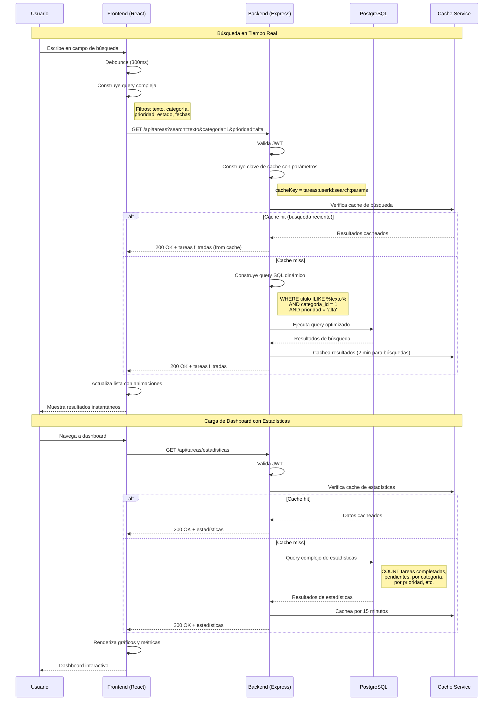
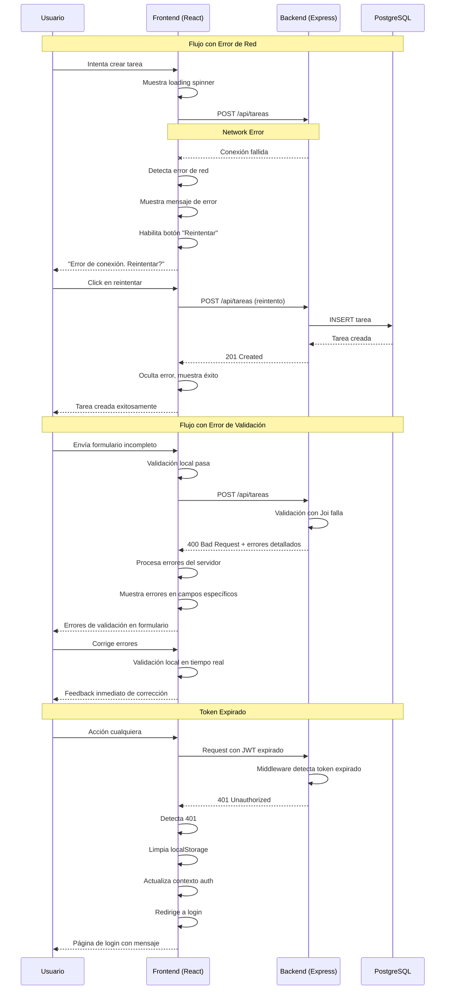

# Diagramas de Secuencia - Todo List Application

## 1. Flujo de Autenticación de Usuario

## 2. Gestión CRUD de Tareas

## 3. Gestión de Categorías y Etiquetas

## 4. Búsqueda y Filtrado Avanzado

## 5. Manejo de Errores y Estados de Carga

## Notas de Implementación

### 🔄 **Patrones de Estado**

- **Optimistic Updates**: Para mejor UX en operaciones frecuentes
- **Loading States**: Spinners y skeleton screens
- **Error Boundaries**: Manejo robusto de errores en React

### 🚀 **Optimizaciones**

- **Debouncing**: Para búsquedas en tiempo real
- **Caching Strategy**:
  - **Búsquedas**: Cache corto (2 min) por alta variabilidad de filtros
  - **Estadísticas**: Cache largo (15 min) por datos más estables
  - **Categorías/Etiquetas**: Cache medio (5 min) por cambios moderados
- **Pagination**: Para listas grandes de tareas

### 🔒 **Seguridad**

- **JWT Validation**: En cada request protegido
- **Ownership Verification**: Usuario solo ve sus datos
- **Rate Limiting**: Previene abuso de API
- **Transaction Safety**: Operaciones complejas en transacciones

### 📱 **UX Considerations**

- **Feedback Inmediato**: Confirmaciones y errores claros
- **Estados Intermedios**: Loading y transiciones suaves
- **Recuperación de Errores**: Opciones de reintento y fallback
- **Confirmaciones**: Para operaciones destructivas (eliminar)

### 💾 **Cache Strategy Justification**

**¿Por qué verificar cache antes de ejecutar búsquedas?**

- **Performance**: Evita consultas costosas repetidas
- **User Experience**: Respuesta instantánea para búsquedas recurrentes
- **Server Load**: Reduce carga en base de datos
- **TTL Diferenciado**:
  - Búsquedas: 2 min (filtros cambian frecuentemente)
  - Estadísticas: 15 min (datos agregados más estables)
  - Listas básicas: 5 min (balance entre frescura y performance)
