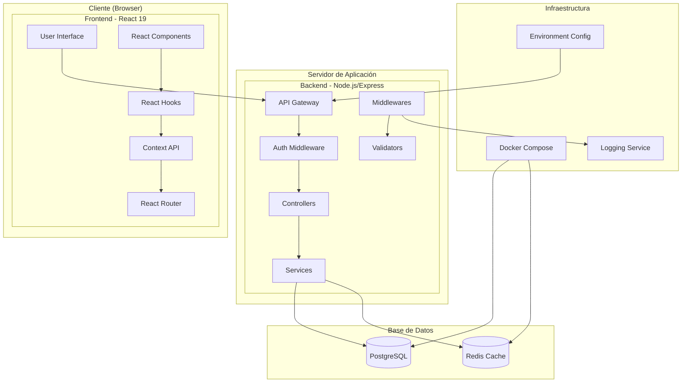
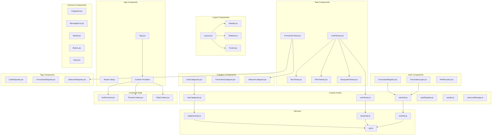
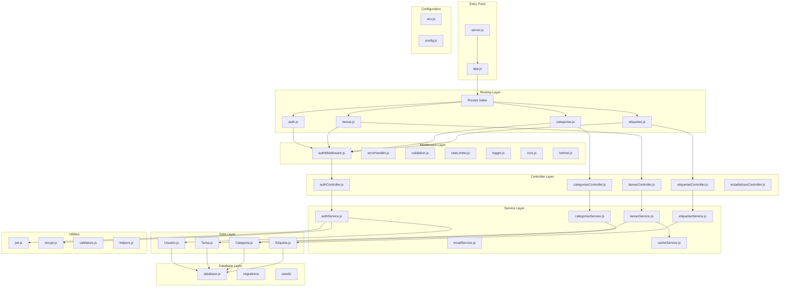
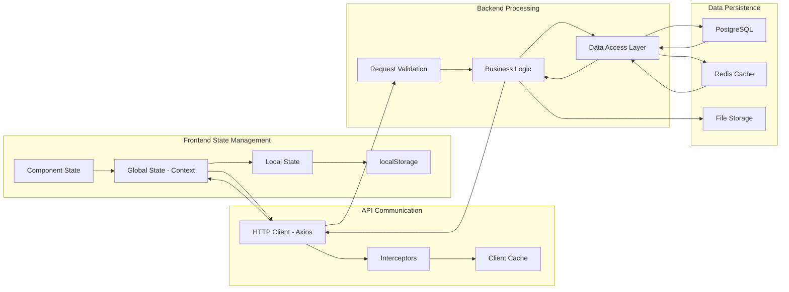

# Diagrama de Componentes - Todo List Application

## Arquitectura General del Sistema



## Detalle de Componentes Frontend (React 19)



## Detalle de Componentes Backend (Node.js/Express)



## Arquitectura de Datos y Flujo



## Patrones de Arquitectura Implementados

### 🏗️ **Frontend Patterns**

1. **Component Composition Pattern**

   - Componentes reutilizables y modulares
   - Props drilling evitado con Context API
   - Higher-Order Components para funcionalidad compartida

2. **Custom Hooks Pattern**

   - Lógica de negocio separada de la UI
   - Reutilización de estado y efectos
   - Testing más fácil

3. **Context + Reducer Pattern**

   - Estado global predecible
   - Acciones tipadas
   - Performance optimizada con useMemo

4. **Service Layer Pattern**
   - API calls centralizadas
   - Interceptors para auth y errores
   - Transformación de datos consistente

### 🚀 **Backend Patterns**

1. **MVC Pattern (Modificado)**

   - Controllers: Manejo de requests/responses
   - Services: Lógica de negocio
   - Models: Acceso a datos

2. **Middleware Pattern**

   - Cross-cutting concerns
   - Pipeline de procesamiento
   - Composabilidad

3. **Repository Pattern**

   - Abstracción de acceso a datos
   - Queries reutilizables
   - Testing mockeable

4. **Dependency Injection**
   - Servicios desacoplados
   - Configuración centralizada
   - Testing unitario facilitado

### 🔄 **Integration Patterns**

1. **API Gateway Pattern**

   - Punto único de entrada
   - Rate limiting centralizado
   - Logging y monitoring

2. **Circuit Breaker Pattern**

   - Resilencia ante fallos
   - Fallback strategies
   - Monitoring de health

3. **Cache-Aside Pattern**
   - Performance optimizada
   - Datos frecuentes en memoria
   - Invalidación inteligente

## Tecnologías y Librerías por Capa

### 📱 **Frontend Stack**

```json
{
  "core": ["react@19", "react-dom@19"],
  "routing": ["react-router-dom@6"],
  "http": ["axios@1.7"],
  "build": ["vite@5.4", "@vitejs/plugin-react@4.3"],
  "testing": ["vitest@2.0", "@testing-library/react@16"],
  "styling": ["css-modules", "postcss"]
}
```

### 🚀 **Backend Stack**

```json
{
  "core": ["express@4.19", "node@20"],
  "database": ["pg@8.12", "pg-pool"],
  "auth": ["jsonwebtoken@9.0", "bcryptjs@2.4"],
  "validation": ["joi@17.13"],
  "security": ["helmet@7.1", "cors@2.8", "express-rate-limit@7.4"],
  "utils": ["morgan@1.10", "dotenv@16.4"],
  "testing": ["jest@29.7", "supertest@7.0"]
}
```

### 🗄️ **Database & Infrastructure**

```json
{
  "database": ["postgresql@16-alpine"],
  "cache": ["redis@7-alpine"],
  "container": ["docker", "docker-compose"],
  "monitoring": ["morgan", "winston"]
}
```

## Consideraciones de Escalabilidad

### 📈 **Performance Optimizations**

- **Frontend**: Code splitting, lazy loading, memoization
- **Backend**: Connection pooling, query optimization, caching
- **Database**: Proper indexing, query analysis, partitioning

### 🔄 **Horizontal Scaling Ready**

- Stateless backend services
- Database connection pooling
- External session storage (Redis)
- Load balancer ready

### 🛡️ **Security Layers**

- Input validation at multiple levels
- SQL injection prevention
- XSS protection
- CSRF tokens
- Rate limiting per user/IP
