# Diagrama de Casos de Uso - Todo List Application

## Vista General del Sistema

```mermaid
graph TB
    subgraph "Sistema Todo List"
        subgraph "Gestión de Usuarios"
            UC1[Registrarse en el Sistema]
            UC2[Iniciar Sesión]
            UC3[Cerrar Sesión]
            UC4[Actualizar Perfil]
            UC5[Cambiar Contraseña]
        end

        subgraph "Gestión de Tareas"
            UC6[Crear Tarea]
            UC7[Listar Tareas]
            UC8[Editar Tarea]
            UC9[Eliminar Tarea]
            UC10[Marcar Tarea como Completada]
            UC11[Buscar Tareas]
            UC12[Filtrar Tareas]
            UC13[Ordenar Tareas]
        end

        subgraph "Gestión de Categorías"
            UC14[Crear Categoría]
            UC15[Listar Categorías]
            UC16[Editar Categoría]
            UC17[Eliminar Categoría]
            UC18[Asignar Categoría a Tarea]
        end

        subgraph "Gestión de Etiquetas"
            UC19[Crear Etiqueta]
            UC20[Listar Etiquetas]
            UC21[Editar Etiqueta]
            UC22[Eliminar Etiqueta]
            UC23[Asignar Etiquetas a Tarea]
            UC24[Quitar Etiquetas de Tarea]
        end

        subgraph "Reportes y Estadísticas"
            UC25[Ver Dashboard]
            UC26[Generar Reportes]
            UC27[Exportar Datos]
            UC28[Ver Estadísticas de Productividad]
        end

        subgraph "Características Avanzadas"
            UC29[Configurar Recordatorios]
            UC30[Cambiar Tema de Interfaz]
            UC31[Reordenar Tareas]
            UC32[Operaciones en Lote]
        end
    end

    %% Actores
    USUARIO[👤 Usuario Registrado]
    VISITANTE[👤 Visitante]
    SISTEMA[🤖 Sistema]

    %% Relaciones de Usuario Registrado
    USUARIO --> UC2
    USUARIO --> UC3
    USUARIO --> UC4
    USUARIO --> UC5
    USUARIO --> UC6
    USUARIO --> UC7
    USUARIO --> UC8
    USUARIO --> UC9
    USUARIO --> UC10
    USUARIO --> UC11
    USUARIO --> UC12
    USUARIO --> UC13
    USUARIO --> UC14
    USUARIO --> UC15
    USUARIO --> UC16
    USUARIO --> UC17
    USUARIO --> UC18
    USUARIO --> UC19
    USUARIO --> UC20
    USUARIO --> UC21
    USUARIO --> UC22
    USUARIO --> UC23
    USUARIO --> UC24
    USUARIO --> UC25
    USUARIO --> UC26
    USUARIO --> UC27
    USUARIO --> UC28
    USUARIO --> UC29
    USUARIO --> UC30
    USUARIO --> UC31
    USUARIO --> UC32

    %% Relaciones de Visitante
    VISITANTE --> UC1
    VISITANTE --> UC2

    %% Relaciones del Sistema
    SISTEMA --> UC29
    SISTEMA --> UC26
```

## Casos de Uso Detallados

### 👤 **UC1: Registrarse en el Sistema**

**Actores:** Visitante  
**Precondiciones:** Usuario no registrado  
**Flujo Principal:**

1. Usuario accede a la página de registro
2. Usuario completa formulario (nombre, email, contraseña)
3. Sistema valida que el email no esté registrado
4. Sistema encripta la contraseña
5. Sistema crea nueva cuenta de usuario
6. Sistema genera token JWT
7. Usuario es redirigido al dashboard

**Flujos Alternativos:**

- **3a.** Email ya registrado: Mostrar error y sugerir login
- **2a.** Datos inválidos: Mostrar errores de validación
- **5a.** Error del servidor: Mostrar mensaje de error y opción de reintento

**Postcondiciones:** Usuario registrado y autenticado en el sistema

---

### 🔐 **UC2: Iniciar Sesión**

**Actores:** Visitante, Usuario Registrado  
**Precondiciones:** Usuario tiene cuenta registrada  
**Flujo Principal:**

1. Usuario accede a la página de login
2. Usuario ingresa email y contraseña
3. Sistema valida credenciales
4. Sistema genera token JWT
5. Usuario es redirigido al dashboard
6. Sistema carga datos iniciales del usuario

**Flujos Alternativos:**

- **3a.** Credenciales incorrectas: Mostrar error
- **3b.** Cuenta inactiva: Mostrar mensaje de cuenta deshabilitada
- **4a.** Error del servidor: Mostrar error y opción de reintento

**Postcondiciones:** Usuario autenticado con sesión activa

---

### ✅ **UC6: Crear Tarea**

**Actores:** Usuario Registrado  
**Precondiciones:** Usuario autenticado  
**Flujo Principal:**

1. Usuario hace clic en "Nueva Tarea"
2. Sistema muestra formulario de creación
3. Usuario completa información obligatoria (título)
4. Usuario opcionalmente añade descripción, categoría, etiquetas, prioridad, fecha vencimiento
5. Usuario guarda la tarea
6. Sistema valida los datos
7. Sistema crea la tarea en la base de datos
8. Sistema actualiza la lista de tareas
9. Sistema muestra confirmación de éxito

**Flujos Alternativos:**

- **6a.** Datos inválidos: Mostrar errores de validación
- **7a.** Error de base de datos: Mostrar error y mantener formulario
- **4a.** Usuario cancela: Cerrar formulario sin guardar

**Postcondiciones:** Nueva tarea creada y visible en la lista

---

### 🔍 **UC11: Buscar Tareas**

**Actores:** Usuario Registrado  
**Precondiciones:** Usuario autenticado, tiene tareas creadas  
**Flujo Principal:**

1. Usuario ingresa texto en campo de búsqueda
2. Sistema aplica debounce (300ms)
3. Sistema busca en títulos y descripciones de tareas
4. Sistema actualiza lista con resultados en tiempo real
5. Usuario ve tareas que coinciden con la búsqueda

**Flujos Alternativos:**

- **4a.** Sin resultados: Mostrar mensaje "No se encontraron tareas"
- **3a.** Error de búsqueda: Mostrar mensaje de error

**Postcondiciones:** Lista filtrada por criterio de búsqueda

---

### 📊 **UC12: Filtrar Tareas**

**Actores:** Usuario Registrado  
**Precondiciones:** Usuario autenticado  
**Flujo Principal:**

1. Usuario selecciona criterios de filtro (estado, categoría, prioridad, fecha)
2. Sistema aplica filtros combinados
3. Sistema ejecuta consulta optimizada
4. Sistema actualiza lista con tareas filtradas
5. Sistema muestra contador de resultados

**Flujos Alternativos:**

- **4a.** Sin resultados: Mostrar mensaje y opción de limpiar filtros
- **2a.** Múltiples filtros: Aplicar lógica AND entre criterios

**Postcondiciones:** Lista de tareas filtrada según criterios seleccionados

---

### 🏷️ **UC23: Asignar Etiquetas a Tarea**

**Actores:** Usuario Registrado  
**Precondiciones:** Usuario autenticado, tarea existe, etiquetas disponibles  
**Flujo Principal:**

1. Usuario edita una tarea existente
2. Sistema carga etiquetas disponibles del usuario
3. Usuario selecciona una o múltiples etiquetas
4. Usuario puede crear nueva etiqueta desde el selector
5. Usuario guarda la tarea
6. Sistema actualiza relaciones en tabla tarea_etiquetas
7. Sistema confirma actualización

**Flujos Alternativos:**

- **4a.** Crear nueva etiqueta: Mostrar modal de creación inline
- **6a.** Error de base de datos: Revertir cambios y mostrar error

**Postcondiciones:** Tarea tiene etiquetas asignadas y se muestran visualmente

---

### 📈 **UC25: Ver Dashboard**

**Actores:** Usuario Registrado  
**Precondiciones:** Usuario autenticado  
**Flujo Principal:**

1. Usuario navega al dashboard
2. Sistema carga estadísticas del usuario:
   - Total de tareas (completadas/pendientes)
   - Tareas por categoría
   - Tareas por prioridad
   - Tareas vencidas
   - Productividad semanal
3. Sistema renderiza gráficos y métricas
4. Usuario puede interactuar con elementos del dashboard

**Flujos Alternativos:**

- **2a.** Sin datos: Mostrar estado vacío con call-to-action
- **2b.** Error de carga: Mostrar skeleton screens y reintento

**Postcondiciones:** Dashboard mostrado con estadísticas actualizadas

---

### 🔄 **UC32: Operaciones en Lote**

**Actores:** Usuario Registrado  
**Precondiciones:** Usuario autenticado, múltiples tareas disponibles  
**Flujo Principal:**

1. Usuario selecciona múltiples tareas usando checkboxes
2. Sistema habilita barra de acciones en lote
3. Usuario selecciona acción (completar, eliminar, cambiar categoría, añadir etiquetas)
4. Sistema muestra confirmación para acción destructiva
5. Usuario confirma la operación
6. Sistema ejecuta operación en transacción
7. Sistema actualiza la interfaz
8. Sistema muestra resumen de operación

**Flujos Alternativos:**

- **4a.** Usuario cancela: Mantener selección sin ejecutar
- **6a.** Error parcial: Mostrar qué elementos fallaron
- **3a.** Acción no aplicable: Deshabilitar opción

**Postcondiciones:** Operación aplicada a todas las tareas seleccionadas

## Matriz de Actores y Casos de Uso

| Caso de Uso           | Visitante | Usuario Registrado | Sistema |
| --------------------- | --------- | ------------------ | ------- |
| Registrarse           | ✅        | ❌                 | ❌      |
| Iniciar Sesión        | ✅        | ✅                 | ❌      |
| Gestión de Tareas     | ❌        | ✅                 | ❌      |
| Gestión de Categorías | ❌        | ✅                 | ❌      |
| Gestión de Etiquetas  | ❌        | ✅                 | ❌      |
| Dashboard y Reportes  | ❌        | ✅                 | ✅      |
| Recordatorios         | ❌        | ✅                 | ✅      |
| Configuraciones       | ❌        | ✅                 | ❌      |

## Priorización de Casos de Uso

### 🔥 **Críticos (MVP)**

1. Registrarse en el Sistema
2. Iniciar Sesión
3. Crear Tarea
4. Listar Tareas
5. Marcar Tarea como Completada
6. Editar Tarea
7. Eliminar Tarea

### ⭐ **Importantes**

1. Buscar Tareas
2. Filtrar Tareas
3. Crear Categoría
4. Asignar Categoría a Tarea
5. Crear Etiqueta
6. Asignar Etiquetas a Tarea
7. Ver Dashboard

### 💡 **Deseables**

1. Ordenar Tareas
2. Generar Reportes
3. Exportar Datos
4. Cambiar Tema de Interfaz
5. Operaciones en Lote
6. Reordenar Tareas
7. Configurar Recordatorios

## Requisitos No Funcionales por Caso de Uso

### 🚀 **Performance**

- **Búsqueda**: Resultados en < 200ms
- **Filtrado**: Aplicación instantánea
- **Carga inicial**: Dashboard en < 1s
- **Operaciones CRUD**: Respuesta en < 500ms

### 🔒 **Seguridad**

- **Autenticación**: JWT con expiración
- **Autorización**: Verificación de ownership
- **Validación**: Cliente y servidor
- **Rate Limiting**: Prevención de abuso

### 📱 **Usabilidad**

- **Responsivo**: Móvil y desktop
- **Accesibilidad**: WCAG 2.1 AA
- **Offline**: Funcionalidad básica sin conexión
- **Estados de carga**: Feedback visual constante

### 🛠️ **Mantenibilidad**

- **Testing**: 80%+ code coverage
- **Documentación**: Casos de uso actualizados
- **Logs**: Trazabilidad completa
- **Monitoreo**: Métricas de uso y performance
